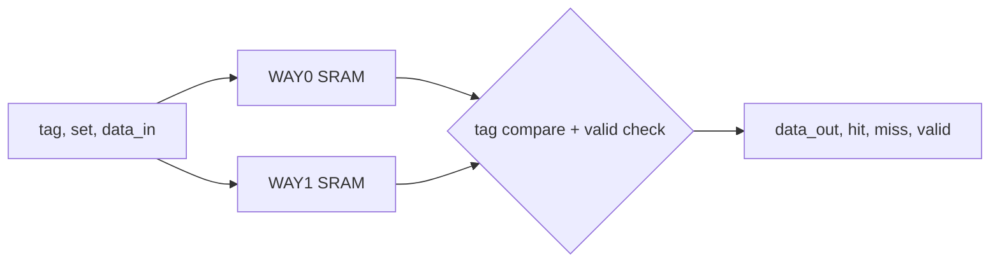

# 2-Way Set Associative Cache Controller

A small 2-way set associative cache written in Verilog. Each way is its own single-port SRAM, and a controller checks both ways in parallel to decide whether a lookup hits or misses. There is a testbench for simulation and a top-level wrapper for the Digilent Arty A7 board.

## Parameters

| | |
|---|---|
| Sets | 2 (1-bit index) |
| Ways | 2 |
| Tag width | 4 bits |
| Data width | 32 bits |
| Line stored in SRAM | 37 bits: `{tag[3:0], valid, data[31:0]}` |

## How it works



**Write** (`write_enable = 1`): the controller packs `{tag, 1, data_in}` into a line and writes it into the way chosen by `way_select` at index `set`. The valid bit is always set on a write.

**Read** (`write_enable = 0`): both SRAMs are read at index `set`. The controller checks each way's valid bit and compares its stored tag with the incoming `tag`.
- way0 matches → hit, return way0 data
- otherwise way1 matches → hit, return way1 data
- neither matches → miss, `data_out` = 0

Some details worth knowing:
- SRAM reads are combinational, but `hit`, `miss`, `valid` and `data_out` are registered, so results show up one clock after you apply `tag`/`set`.
- Reset clears both SRAMs, which also clears every valid bit. Every lookup misses after a reset.
- With `chip_enable` low, the flags go to 0 and `data_out` keeps its last value.
- During a write cycle the outputs hold their previous values.
- There's no replacement policy. The caller picks the way with `way_select`, so writing to a way that's already in use just overwrites it.

## Files

```
rtl/
  single_port_sram.v    2-entry x 37-bit memory, one per way
  cache_controller.v    the cache itself: two SRAMs + tag compare
  cache_top.v           Arty A7 wrapper (switches/buttons/LEDs)
  debounce.v            button debouncer used by cache_top
tb/
  cache_controller_tb.v directed testbench
constraints/
  arty_a7.xdc           pin assignments for cache_top
```

## Simulation

Needs [Icarus Verilog](https://steveicarus.github.io/iverilog/). Run from the repo root:

```bash
iverilog -o cache_sim rtl/single_port_sram.v rtl/cache_controller.v tb/cache_controller_tb.v
vvp cache_sim
```

The testbench writes to both ways of set 0 and to way0 of set 1, then reads them back with correct and wrong tags. Expected output:

```
Empty read set0    : hit=0 miss=1 valid=0 data=00000000
Way0 correct tag   : hit=1 miss=0 valid=1 data=5aa9a645
Way0 wrong tag     : hit=0 miss=1 valid=0 data=00000000
Way1 correct tag   : hit=1 miss=0 valid=1 data=11978104
Set1 Way0 hit      : hit=1 miss=0 valid=1 data=fedefa7f
Set1 wrong tag     : hit=0 miss=1 valid=0 data=00000000
Set0 Way0 recheck  : hit=1 miss=0 valid=1 data=5aa9a645
Chip disabled      : hit=0 miss=0 valid=0
```

## Running it on the Arty A7

Synthesize with `cache_top` as the top module and `constraints/arty_a7.xdc` for the pins. The board doesn't have enough switches for a real tag and 32-bit word, so two buttons pick between fixed values instead.

| Input | Board | Function |
|---|---|---|
| `sys_clk` | 100 MHz oscillator | runs the debouncer |
| `step_btn` | BTN0 | press to step the cache one clock |
| `reset` | BTN1 | reset (hold while pressing BTN0) |
| `tag_sel` | BTN2 | released = tag `3`, held = tag `7` |
| `data_sel` | BTN3 | released = `AAAA5555`, held = `12345678` |
| `chip_enable` | SW0 | enable |
| `write_enable` | SW1 | 1 = write, 0 = read |
| `way_select` | SW2 | way to write into |
| `set` | SW3 | set index |

| Output | Board | Meaning |
|---|---|---|
| `hit` | LD4 | lookup hit |
| `miss` | LD5 | lookup miss |
| `valid` | LD6 | returned data is valid |
| `dout_led` | LD7 | bit 0 of `data_out` (on for `AAAA5555`, off for `12345678`) |

Example: SW0 on, SW1 on, press BTN0 to write `AAAA5555` with tag 3 into way0, set 0. Then switch SW1 off and press BTN0 again. LD4 (hit) and LD7 should light up.

BTN0 goes through a debouncer clocked by the 100 MHz oscillator. The button has to be stable for 10 ms before the change is accepted. The clean output is then used as the cache clock, so one press is exactly one rising edge, applied on press, not release. The other buttons and switches are just held levels, so they don't need debouncing.

## Possible extensions

- LRU bit per set so the cache picks the victim way itself
- Dirty bit and write-back to a backing memory on eviction
- Parameterize the number of sets, tag width and data width
- Self-checking testbench instead of reading `$display` output by eye
